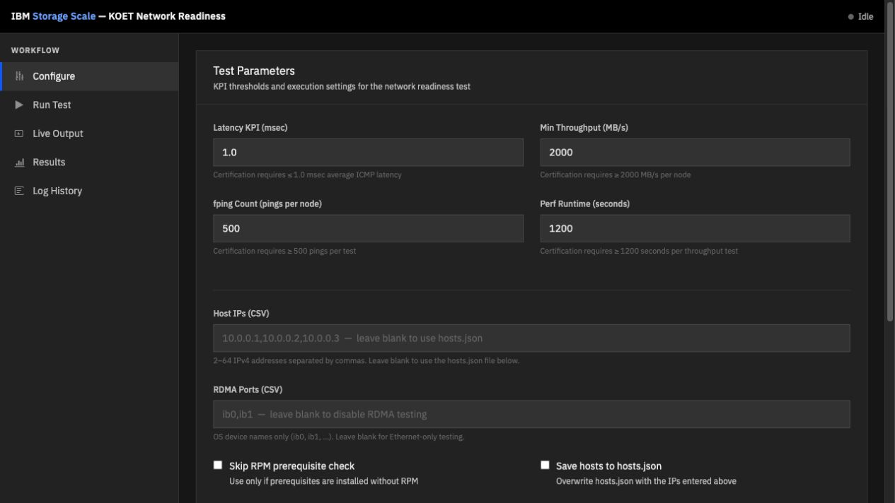
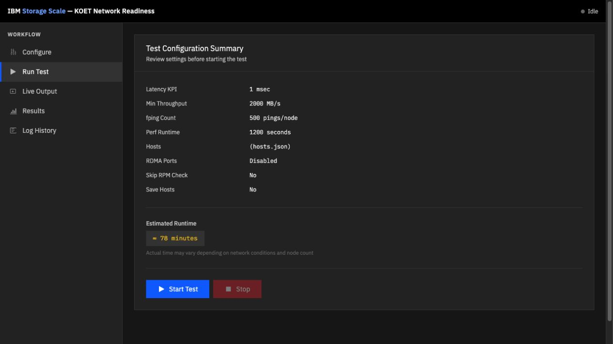

KOET (Keep On Executing Tests) validates IBM Storage Scale network readiness by running fping latency tests and nsdperf throughput tests across all cluster nodes, then comparing results against IBM KPIs.

**NOTE:** This test can require a long time to execute, depending on the number of nodes. An estimated runtime is displayed at startup.

**WARNING:** This is a network stress tool. Running it while the network is in use for other services will cause service degradation. This tool, as stated in the license, comes with no warranty of any kind.

## Quick Start

**From a git clone (no install required):**
```shell
git clone https://github.com/cdmaestas/StorageScale_NETWORK_READINESS
cd StorageScale_NETWORK_READINESS
./start.sh          # installs Flask/distro if missing, starts the web UI
```
Then open **http://127.0.0.1:5002** in a browser on the same machine.

**From an SSH tunnel (workstation browser → cluster node):**
```shell
ssh -L 5002:127.0.0.1:5002 root@cluster-node
# on the node:
./start.sh
```

**Install as an RPM or DEB package:**
```shell
cd packaging
./build-pkg.sh                                   # builds dist/koet-*.rpm and dist/koet_*.deb
sudo dnf install dist/koet-1.18.0-1.noarch.rpm   # RHEL / Rocky
sudo apt install ./dist/koet_1.18.0-1_all.deb    # Debian / Ubuntu
koet-ui                                          # start the web UI
sudo systemctl enable --now koet                 # optionally run as a service
```

## Web UI

A browser-based interface is available for configuring and running tests without touching the CLI.

The web UI provides:
- **Configure panel** — set KPI thresholds, host IPs, RDMA ports, and edit `hosts.json` directly in the browser
- **Run panel** — review the full configuration and estimated runtime before starting
- **Live Output panel** — color-coded streaming terminal output with a phase progress bar; inline confirmation widget handles the `Do you want to continue?` prompt
- **Results panel** — Chart.js bar charts for throughput and latency per host, plus a KPI pass/fail summary table
- **Log History panel** — load and review results from any previous run

The web server binds to `127.0.0.1` only and is not accessible from other machines without an SSH tunnel.

### Visual walkthrough

Set the certification thresholds, hosts, and optional RDMA ports in the Configure panel. The built-in `hosts.json` editor lets you load or save the cluster node list without leaving the UI.



Before starting, the Run Test panel presents the selected settings and estimated duration for review. Start the test only after confirming the target hosts and runtime are appropriate for the environment.



## CLI Usage

**Run with hosts specified on the command line (saves hosts.json for future runs):**
```shell
# IPs or hostnames — both work
./koet.py --hosts 10.10.12.92,10.10.12.93,10.10.12.94,10.10.12.95 --save-hosts
./koet.py --hosts node1,node2,node3,node4 --save-hosts
```

**Run using a pre-populated hosts.json:**
```shell
./koet.py
```
`hosts.json` accepts either IP addresses or hostnames as keys:
```json
{"node1": "ECE", "node2": "ECE", "node3": "ECE", "node4": "ECE"}
```
Hostnames are resolved to IPv4 via DNS at startup and logged: `OK: resolved node1 -> 10.10.12.92`.

**RDMA test (checks ib0 and ib1 on all nodes):**
```shell
./koet.py --rdma ib0,ib1
```

**Full CLI reference:**
```
usage: koet.py [-h] [-l KPI_LATENCY] [-c FPING_COUNT] [--hosts HOSTS_CSV]
               [-m KPI_THROUGHPUT] [-p PERF_RUNTIME] [--rdma PORTS_CSV]
               [--rpm_check_disabled] [--save-hosts] [-v]

optional arguments:
  -h, --help            show this help message and exit
  -l KPI_LATENCY        Max latency in msec (KPI minimum: 1.0)
  -c FPING_COUNT        fping count per node (KPI minimum: 500)
  --hosts HOSTS_CSV     Comma-separated IPs or hostnames; overrides hosts.json
  -m KPI_THROUGHPUT     Min throughput in MB/sec (KPI minimum: 2000)
  -p PERF_RUNTIME       nsdperf runtime in seconds (KPI minimum: 1200)
  --rdma PORTS_CSV      Enable RDMA and specify ports (e.g. ib0,ib1)
  --rpm_check_disabled  Skip RPM prerequisite checks
  --save-hosts          Write hosts.json from --hosts (no confirmation prompt)
  -v, --version         Show version number and exit
```

## Prerequisites

**On every cluster node:**
```shell
sudo dnf install gcc-c++ psmisc fping python3-distro   # RHEL / Rocky
```

The tool checks for these packages via RPM by default. If installed by other means, use `--rpm_check_disabled`.

- fping is available from [EPEL](https://fedoraproject.org/wiki/EPEL)
- gcc-c++ and psmisc are in the standard RHEL AppStream / BaseOS repositories

**For the web UI only** (on the node running `koet-server.py`):
```shell
pip3 install flask distro    # or just run ./start.sh — it installs these automatically
```

## Requirements and Constraints

- **Supported OS:** RHEL 7.6+, 8.6+, 9.x, 10.x and Rocky Linux 8.6+, 9.x, 10.x (x86_64 and ppc64le). Unknown point releases within a supported major version are accepted automatically (e.g. RHEL 9.6, Rocky 9.7).
- **SSH:** Root passwordless SSH must be configured from the node running the tool to all cluster nodes.
- **Local filesystem:** Run the tool from a local filesystem — not NFS, Storage Scale, or similar.
- **Firewalld:** Must be stopped on all nodes during the test.
- **TCP port 6668:** Must be free and reachable on all nodes.
- **RDMA:** All Mellanox ports on all nodes must be in InfiniBand mode (not Ethernet). Ports tested must show UP state in `ibdev2netdev`.
- **Hosts:** Minimum 2, maximum 64. The node running the tool must be one of the tested nodes.
- **Long runs:** Use `screen` or `tmux` if you plan to disconnect — do not use `nohup`.
- **KPI minimums for certification:** fping count ≥ 500, perf runtime ≥ 1200 s, latency ≤ 1.0 msec, throughput ≥ 2000 MB/sec.
- **Output:** Returns 0 if all tests pass on all nodes, non-zero otherwise. Log files are written to `log/YYYY-MM-DD_HH-MM-SS/`.

## Sample Output

Successful 4-node run:
```
./koet.py

Welcome to KOET, version 1.18

JSON files versions:
    supported OS:    2.0
    packages:        1.1
    packages RDMA:   1.0

Please use https://github.com/cdmaestas/StorageScale_NETWORK_READINESS to get latest versions and report issues about this tool.

The purpose of KOET is to obtain IPv4 network metrics for a number of nodes.

The latency KPI value of 1.0 msec is good to certify the environment
The fping count value of 500 pings per test and node is good to certify the environment
The throughput value of 2000 MB/sec is good to certify the environment
The performance runtime value of 1200 seconds per test and node is good to certify the environment

It requires remote SSH passwordless access between all nodes for user root

This test run estimation is 336 minutes

This software comes with absolutely no warranty of any kind. Use it at your own risk

NOTE: The bandwidth numbers shown in this tool are for a very specific test. This is not a storage benchmark.
They do not necessarily reflect the numbers you would see with Storage Scale and your particular workload

Do you want to continue? (y/n): y

OK: Red Hat Enterprise Linux 9.4 is a supported OS for this tool

OK: SSH with node 10.10.12.93 works
OK: SSH with node 10.10.12.92 works
OK: SSH with node 10.10.12.95 works
OK: SSH with node 10.10.12.94 works

Checking packages install status:

OK: on host 10.10.12.93 the psmisc installation status is as expected
OK: on host 10.10.12.93 the fping installation status is as expected
OK: on host 10.10.12.93 the gcc-c++ installation status is as expected
...
OK: on host 10.10.12.94 TCP port 6668 seems to be free

Starting ping run from 10.10.12.93 to all nodes
Ping run from 10.10.12.93 to all nodes completed
...

Starting throughput tests. Please be patient.
...

Results for ICMP latency test 1:n
OK: on host 10.10.12.93 the 1:n average ICMP latency is 0.37 msec. Which is lower than the KPI of 1.0 msec
OK: on host 10.10.12.93 the 1:n maximum ICMP latency is 0.45 msec. Which is lower than the KPI of 2.0 msec
OK: on host 10.10.12.93 the 1:n minimum ICMP latency is 0.31 msec. Which is lower than the KPI of 1.0 msec
OK: on host 10.10.12.93 the 1:n standard deviation of ICMP latency is 0.02 msec. Which is lower than the KPI of 0.33 msec
...

Results for throughput test
OK: on host 10.10.12.93 the throughput test result is 2354 MB/sec. Which is more than the KPI of 2000 MB/sec
OK: on host 10.10.12.92 the throughput test result is 2389 MB/sec. Which is more than the KPI of 2000 MB/sec
OK: on host 10.10.12.95 the throughput test result is 2312 MB/sec. Which is more than the KPI of 2000 MB/sec
OK: on host 10.10.12.94 the throughput test result is 2392 MB/sec. Which is more than the KPI of 2000 MB/sec
OK: the difference of bandwidth between nodes is 10.16% which is less than 20% defined on the KPI

The summary of this run:

        The 1:n fping average latency was successful in all nodes
        The 1:n throughput test was successful in all nodes

OK: All tests had been passed. You can proceed with the next steps
```

## Issues

Please open issues at https://github.com/cdmaestas/StorageScale_NETWORK_READINESS/issues
